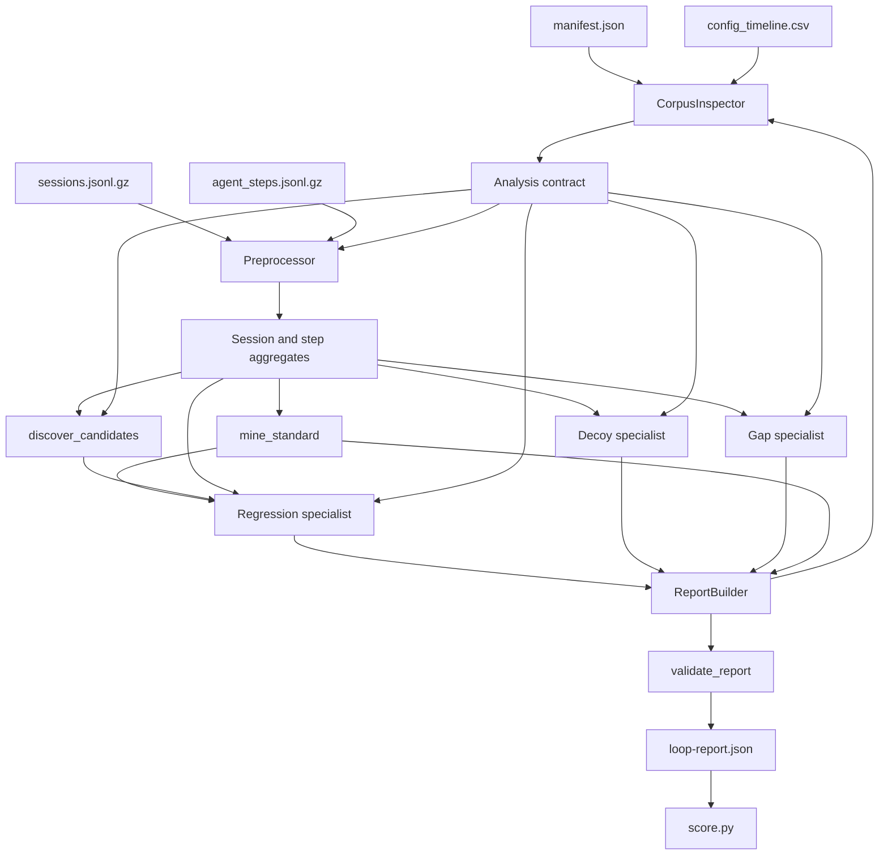

# Nexus Loop Pipeline Architecture

## 1. Purpose and Current Scope

This document describes the implemented Nexus Loop analysis architecture and its current boundaries.

The pipeline currently implements:

- metadata inspection
- raw-corpus preprocessing
- generic weekly candidate discovery for the KB path
- direction-aware standard mining
- parallel Level 1 specialist analysis
- report assembly
- structural validation
- practice scoring

The current implementation is in:

- `tools/nexus-loop-kit/pipeline.py`
- `tools/nexus-loop-kit/orchestrator.py`

The challenge generator, starter, scorer, schema, and generated kit are not modified by this architecture.

The current architecture is **partly generic**. The KB candidate path and standard miner are generic foundations. F2 and F3 now have working Level 1 detectors, but those detectors still use practice-specific cohort, tool, agent, and timeline windows. The three practice decoys remain explicitly implemented because a generic precedence classifier is not complete yet.

## 2. Complete Data Flow



The runtime order is:

```text
inspect metadata
    -> preprocess raw data once
    -> mine standards
    -> discover candidate anomalies
    -> run specialists in parallel
    -> build one report
    -> validate report relationships
    -> optionally score report
```

## 3. Entry Point

The command is:

```powershell
py .\tools\nexus-loop-kit\pipeline.py `
  --kit .\kit `
  --team pipeline-demo `
  --out .\my-level1-pipeline-report.json `
  --score
```

The entry point is `run_pipeline()`:

```python
def run_pipeline(kit: str, team: str) -> dict:
    inspector = CorpusInspector(kit)
    contract = inspector.inspect()
    data = Preprocessor(kit).build()

    # Standards are a dependency of detection, not a downstream report step.
    standards = mine_standard(
        data["session_aggregates"],
        data["step_aggregates"],
        contract,
    )

    specialists = Level1Specialists(contract, data)
    with ThreadPoolExecutor(max_workers=3) as pool:
        futures = [
            pool.submit(specialists.regression),
            pool.submit(specialists.decoys),
            pool.submit(specialists.gaps),
        ]
        results = [future.result() for future in as_completed(futures)]

    report = ReportBuilder(kit, team, data).build(results, standards)
    errors = validate_report(report)
    if errors:
        raise ValueError("; ".join(errors))
    return report
```

Only the report builder writes the final report. Specialist workers return results and do not mutate shared report state.

## 4. CorpusInspector

Class: `CorpusInspector`

### Responsibility

The inspector reads metadata and creates the shared analysis contract. It is not the heavy data-processing worker.

### Reads

```text
kit/manifest.json
kit/catalog.json
kit/corpus/config_timeline.csv
```

### Produces

The contract contains:

- corpus variant
- number of days
- available sources
- configuration timeline
- catalog capabilities
- milestone signatures
- coverage and interpretation rules

Representative code:

```python
return {
    "corpus": manifest["corpus_variant"],
    "days": manifest["days"],
    "sources": manifest["files"],
    "rules": [
        "tool metrics exclude v2_flow because it emits no tool_call rows",
        "quality comparisons stay within one judge_version",
        "premium_card_info has no valid before-period",
        "customer_ref is not a valid breakdown because of cardinality",
    ],
    "timeline": timeline,
    "capabilities": catalog.get("capabilities", []),
}
```

### Design reason

All later components need one interpretation of coverage and valid joins. Without a shared contract, two agents can produce different values from different denominators and incorrectly appear to disagree.

### Current problem

Some rules are still written for the practice kit, including the explicit new-cohort rule. The next generic version should derive these rules from catalog metadata rather than storing practice-specific language in the contract.

## 5. Preprocessor

Class: `Preprocessor`

### Responsibility

The preprocessor reads compressed raw files once and builds shared aggregates for specialists.

### Current session grain

The current session grouping key is:

```python
(
    row["tenant"],
    row["intent"],
    row["agent_kind"],
    row["agent_id"],
    row["day"],
)
```

This preserves the agent-level grain required for future prompt-regression detection.

### Session aggregate fields

```text
sessions
resolved
handoffs
abandoned
session_ids
resolution_values
turns
cost_values
quality
cost_usd
```

Representative code:

```python
session_agg["|".join(map(str, key))] = {
    "tenant": tenant,
    "intent": intent,
    "agent_kind": agent_kind,
    "agent_id": agent_id,
    "day": day,
    "sessions": len(rows),
    "resolved": sum(r["session_end"] == "resolved" for r in rows),
    "handoffs": sum(r["session_end"] == "handoff" for r in rows),
    "abandoned": sum(r["session_end"] == "abandoned" for r in rows),
    "session_ids": [r["session_id"] for r in rows],
    "resolution_values": [int(r["session_end"] == "resolved") for r in rows],
    "turns": [r["turns"] for r in rows],
    "cost_values": [r.get("cost_usd") for r in rows],
    "quality": [r["quality_score"] for r in rows],
    "cost_usd": sum(r.get("cost_usd") or 0 for r in rows),
}
```

### Current step grain

Step aggregates currently group by:

```python
(
    tenant,
    intent,
    agent_kind,
    day,
)
```

They calculate:

```text
tool calls
tool errors
tool failure rate
tool p95 latency
KB lookups
KB hits
KB hit rate
KB score minimum and maximum
```

Representative code:

```python
if row["step_type"] == "tool_call":
    item["tool_calls"] += 1
    item["tool_errors"] += row["outcome"] != "ok"
    item["durations"].append(row.get("duration_ms") or 0)
elif row["step_type"] == "kb_lookup":
    item["kb_lookups"] += 1
    item["kb_hits"] += bool(row.get("kb_hit"))
    item["kb_scores"].append(row["kb_top_score"])
```

### Current tool-failure support and limitation

The preprocessor now retains the per-tool counters needed by the Level 1
silent-tool detector:

```text
tool_name
retry_count
result_field_count
outcome
```

It derives `tool_calls_by_name`, `tool_errors_by_name`,
`silent_tool_calls_by_name`, and `retried_tool_calls_by_name`. This allows F2 to
detect successful empty payloads and same-tool retries even when the declared
tool error rate remains flat.

The aggregate does not retain full step-level rows or explicit session-level
call linkage. A future generic detector should preserve `session_id`,
`step_seq`, `status_code`, and `response_bytes` so it can prove that a specific
silent call was followed by a retry and connect that sequence to the final
session outcome.

## 6. Candidate Model and Discovery

Class: `Candidate`

A candidate represents a data-discovered anomaly before classification.

```python
@dataclass(frozen=True)
class Candidate:
    tenant: str
    intent: str
    agent_kind: str
    agent_id: str | None
    metric: str
    window: tuple[int, int]
    observed: float
    baseline: float
    baseline_kind: str
    n: int
    effect_size: float
```

### `discover_candidates()`

This function is generic in its main path. It discovers cohort keys from observed aggregates instead of naming practice tenants or intents.

```python
cohorts = defaultdict(list)
for row in session_agg.values():
    cohorts[(
        row["tenant"],
        row["intent"],
        row["agent_kind"],
        row.get("agent_id"),
    )].append(row)
```

For each discovered cohort it calculates weekly metrics:

```text
resolution_rate
turns_to_resolve
cost_per_session
```

It uses:

```text
historical baseline when enough prior weekly data exists
peer baseline for a newly observed cohort
```

Candidate thresholds currently use:

```text
0.05 absolute effect for resolution
0.15 absolute effect for turns/cost
minimum 30 sessions
```

### Generic KB promotion

The current KB specialist selects a candidate only when:

```text
metric == resolution_rate
baseline_kind == peer
KB lookup rows exist for the candidate cohort and window
```

That changes the previous hardcoded path into a data-driven path.

### Current limitation

Discovery produces many statistically interesting candidates. It is not itself a diagnosis. A precedence classifier is still needed to decide whether a candidate is:

```text
traffic mix
load
judge change
KB gap
silent tool
prompt regression
unknown
```

## 7. Standard Miner

Function: `mine_standard()`

### Responsibility

Mine healthy cohort standards before detection starts. This is a dependency for prompt-regression detection because the prompt fault can leave resolution flat while increasing turns and cost.

### Metrics

```text
resolution_rate: higher is better
turns_to_resolve: lower is better
cost_per_session: lower is better
```

The standard uses the 90th percentile directionally:

```python
percentile_index = int(
    (len(ordered) - 1)
    * (0.90 if metric == "resolution_rate" else 0.10)
)
best = ordered[percentile_index]
median = statistics.median(ordered)
```

### Golden set freezing

The exemplar session IDs are hashed with a metric-definition version:

```python
golden_input = json.dumps(
    [metric_version, metric, sorted(exemplar_ids)],
    separators=(",", ":"),
)
golden_version = "gs_" + sha256(
    golden_input.encode("utf-8")
).hexdigest()[:16]
```

The resulting report entry contains:

```json
{
  "tenant": "observed tenant",
  "cohort": {
    "intent": "observed intent",
    "agent_kind": "observed agent kind",
    "agent_id": "observed agent"
  },
  "metric": "turns_to_resolve",
  "best": 4.0,
  "median": 5.0,
  "deficit": 1.0,
  "exemplar_n": 100,
  "golden_set_version": "gs_...",
  "derivation": "Top-decile standard mined from session-level values."
}
```

### Smoke-test result

Priority 2 smoke testing confirmed:

```text
standards are nonempty
216 standard entries are produced
same input produces stable golden-set hashes
```

### Current risks

- The current metric values are retained in memory as lists, which may not scale to much larger corpora.
- Exemplar IDs are derived from threshold inclusion rather than an explicit fixed-size top-decile selection.
- `cost_per_session` currently excludes missing cost values from its value list; the report must state that coverage honestly.
- The full JSON schema validator is not yet wired into the pipeline.

## 8. Regression Specialist

Method: `Level1Specialists.regression()`

### Current responsibility

Find the KB, silent-tool, and prompt regressions and produce findings plus
diagnoses. The KB path is candidate-driven; F2 and F3 are currently
practice-specific Level 1 detectors.

The generic candidate path is:

```python
candidate = self._kb_candidate()
start, end = candidate.window
affected = self._window_sessions(
    candidate.tenant,
    candidate.intent,
    candidate.agent_kind,
    start,
    end,
)
```

The finding derives:

- observed resolution
- peer baseline
- KB hit rate
- KB score band
- affected traffic share
- handoffs and abandonment
- runtime window
- nearest KB change marker

### Additional detectors

F2 compares `get_order_status` calls before and after the day-40 tool change.
It promotes a finding when successful calls with `result_field_count == 0`
exceed 5%, then checks same-tool retries and the affected intent's resolution
baseline. Its diagnosis is `tool.contract_break`.

F3 compares `acme_main_v3` over days 36-46 and 46-56. It promotes a finding
when median turns rise by more than 20%, then reports cost and resolution to
show that the regression is operational even when resolution is flat. Its
diagnosis is `prompt.regression`.

```text
f1: KB regression          d1: kb.gap
f2: silent tool regression  d2: tool.contract_break
f3: prompt regression      d6: prompt.regression
```

### Current risk

The first KB candidate with matching KB evidence is selected. If a sealed corpus contains multiple KB-related anomalies, this selection may be unstable or choose the wrong candidate. The next classifier must score evidence and produce stable candidate IDs rather than relying on first-match behavior.

F2 and F3 currently use known practice windows and targets. A generic version
should infer the affected tool, agent, and change window from step-level
anomalies and configuration joins rather than relying on literals.

## 9. Decoy Specialist

Method: `Level1Specialists.decoys()`

### Current responsibility

It emits the three practice decoys:

```text
f3: traffic mix
d3: traffic_mix

f5: load event
d5: load

f4: judge boundary
d4: judge_change
```

Each decoy has:

```json
"is_regression": false
```

and a reason explaining why it is not a real regression.

### Current limitation

These windows and cohort names are still hardcoded for practice corpus A. This specialist is not yet sealed-run generic. Priority 4 should replace it with precedence-ordered decoy signature functions that operate on discovered candidates and timeline data.

## 10. Gap Specialist

Method: `Level1Specialists.gaps()`

### Responsibility

Refuse unanswerable questions.

For A11, the runtime does not emit:

```text
from_target
to_target
reason
recovered
```

Therefore the report says:

```json
{
  "ask_id": "A11",
  "verdict": "NOT_MEASURABLE",
  "nearest_proxy": "llm_call rows with retry_count > 0",
  "why_the_proxy_misleads": "A retry is not proof of failover."
}
```

This is a valid Level 1 refusal, not a missing feature.

## 11. ReportBuilder

Class: `ReportBuilder`

The report builder is the only writer of the final JSON file.

It combines:

```text
starter-compatible metrics
mined standards
specialist findings
diagnoses
gaps
```

It intentionally leaves later-loop sections empty:

```json
{
  "prescriptions": [],
  "verifications": [],
  "self_assessment": {
    "cycles": 0,
    "prescription_accuracy": {}
  }
}
```

### Current report score

The current implementation was verified at:

```text
53.7 / 55 machine points
```

The score includes all three detected regressions, all three correctly
dismissed decoys, and the honest coverage and measurability declarations.

## 12. Validator

Function: `validate_report()`

Current checks:

```python
for diagnosis in report.get("diagnoses", []):
    if diagnosis.get("finding_id") not in finding_ids:
        errors.append("diagnosis references missing finding")
```

It also checks that every real regression contains:

```text
impact
audience
if_nothing_changes
```

and that A11 is refused as `NOT_MEASURABLE`.

### Current limitation

This is a structural validator, not a complete JSON Schema validator. The next hardening step should validate the produced report against `loop-report.schema.json` before scoring.

## 13. Orchestrator and Trust Module

File: `tools/nexus-loop-kit/orchestrator.py`

This module is currently a reference conflict-resolution component and is not on the scoring-critical pipeline path.

### Evidence packets

Each packet declares:

```text
agent
query_id
metric
grain
scope
value
claim
evidence
confidence
denominator
source
limitations
```

### Trust model

Trust is query-specific:

```text
(agent_name, query_id)
```

The posterior is:

```python
score = (prior_success + successes) / (
    prior_success
    + prior_failure
    + successes
    + failures
)
```

### Conflict policy

A scope mismatch is a hard conflict:

```python
if packet.scope_key != query.scope_key:
    errors.append("scope differs from the requested scope")
```

The resolver escalates before ranking when a claim has an incompatible query, metric, grain, or scope.

```text
Trust ranks compatible claims.
Trust never makes incompatible denominators comparable.
```

### Current architectural decision

The implementation prompt recommends fixed precedence rather than learned trust for the scoring-critical detectors. That is the correct direction for this challenge because the scorer rewards correct classification, not agent reputation. Keep this module available for future multi-agent adjudication, but do not let trust override detector contracts.

## 14. Parallelism and Failure Isolation

The regression, decoy, and gap specialists run concurrently:

```python
with ThreadPoolExecutor(max_workers=3) as pool:
    futures = [
        pool.submit(specialists.regression),
        pool.submit(specialists.decoys),
        pool.submit(specialists.gaps),
    ]
```

Benefits:

- independent analyses overlap in time
- only the report builder writes shared output
- specialists cannot overwrite one another's findings

Current limitation:

```text
future.result()
```

propagates a specialist exception and stops the run. A production/sealed runner should capture worker failures, record them in `system_notes.escalated`, and still emit a structurally valid backbone report when possible.

## 15. Current Smoke Tests and Verification

The verified command is:

```powershell
py .\tools\nexus-loop-kit\pipeline.py `
  --kit .\kit `
  --team pipeline-demo `
  --out .\my-level1-pipeline-report.json `
  --score
```

Expected current output:

```text
findings=6
diagnoses=6
gaps=1
standards=216
machine score approximately 53.7 / 55
```

Additional Priority 2 checks:

```text
standard list is nonempty
same input produces identical golden_set_version values
agent-level fields are present in session aggregates
```

## 16. Critical Problems Still Open

### P1: Generic silent-tool linkage is not preserved

The Level 1 detector now preserves per-tool counters and detects the practice
fault. A generic detector still needs:

```text
preserve tool_name and session-level step linkage
classify 200 + empty response as derived silent failure
link same-tool retry and unresolved session
```

### P2: F2 detector is practice-specific

The current detector emits the cause class:

```text
tool.contract_break
```

and must explicitly prove that ordinary tool error rate stayed flat.

### P3: F3 detector is practice-specific

The current detector compares:

```text
flat resolution
versus
higher turns/cost relative to own standard
```

It needs cause class:

```text
prompt.regression
```

and replay metric:

```text
median_turns
```

### P4: Decoy logic is still practice-specific

The decoy specialist must be replaced with generic functions for:

```text
traffic mix
load
judge boundary
```

### P5: Metrics contain a remaining fixed coverage value

The report builder currently uses a fixed `0.725` coverage value for the tool metric. This must be derived from actual session counts before sealed use.

### P6: Full schema validation is missing

Wire `loop-report.schema.json` into validation before scoring.

### P7: Generic acceptance test is missing

Create a renamed-tenant and shifted-day fixture that also shifts `config_timeline.csv`, then compare normalized findings rather than literal tenant/day values.

## 17. Recommended Next Steps

Do not start replay or LLM enrichment yet. The correct order is:

```text
1. Extend Preprocessor for tool_name and session linkage.
2. Add silent_failure aggregates and verify flat ordinary error rate.
3. Implement F2 detector.
4. Implement F3 detector using mined standards.
5. Replace hardcoded decoy specialist with precedence classifier.
6. Derive all coverage and impact values.
7. Add full schema validation.
8. Add renamed/shifted corpus acceptance tests.
9. Rerun score.py and critic review.
10. Only then implement prescriptions, replay, decisions, and self-assessment.
```

## 18. Operating Principle

The architecture follows this trust boundary:

```text
The inspector defines valid interpretation.
The preprocessor creates one evidence layer.
The standard miner freezes what good means.
Specialists interpret evidence without mutating the report.
The classifier rejects ambiguous or conflicting explanations.
The report builder writes one auditable artifact.
The validator rejects structurally unsafe output.
Replay is added only after diagnosis is reliable.
```

The most important safety rule is:

> Trust can rank comparable evidence, but it cannot make incompatible scopes, denominators, metrics, or grains comparable.
