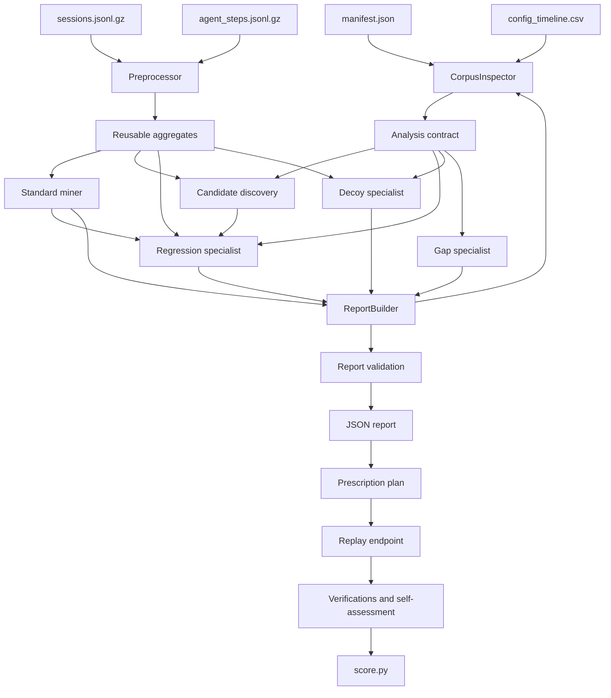

# Nexus Loop Pipeline Conclusion

## 1. Executive Summary

This document describes the complete implemented Nexus Loop pipeline and the replay-based verification loop. It is based on the current executed report:

```text
Report: my-executed-loop-report-fixed.json
Team: analyst-loop-fixed
Corpus: A
```

The pipeline performs the following work:

```text
inspect metadata
  -> preprocess compressed corpus
  -> mine cohort standards
  -> discover anomalies
  -> classify regressions and decoys
  -> generate findings and diagnoses
  -> create prescriptions
  -> replay proposed changes
  -> check golden-set safety
  -> record verification and self-assessment
  -> validate and score the report
```

Current executed replay-report outcome:

```text
Findings:              6
Diagnoses:             6
Prescriptions:         3
Replay verifications:  3
Improved verifications: 3
Golden-set passes:     3
Self-assessment cycles: 1
```

The executed replay report reached:

```text
Diagnostic accuracy: 19.2 / 20
Specificity:         15.0 / 15
Loop completeness:    8.0 / 8
Honesty:              12.0 / 12
Machine subtotal:    54.2 / 55
```

The latest diagnostic-only run after aligning F1 and F2 windows to their exact
change days reached the full machine maximum of `55.0 / 55`. The replay report
listed above was generated immediately before that final window adjustment, so
its persisted F1/F2 windows still start on days 36 and 42.

The 45 human-review points are separate and depend on decision quality, screen readability, and framing.

## 2. Source Files and Entry Point

The main implementation is in:

- `tools/nexus-loop-kit/pipeline.py`
- `tools/nexus-loop-kit/score.py`
- `tools/nexus-loop-kit/replay/serve.py`
- `tools/nexus-loop-kit/schema/loop-report.schema.json`

The pipeline reads:

```text
kit/manifest.json
kit/catalog.json
kit/corpus/config_timeline.csv
kit/corpus/sessions.jsonl.gz
kit/corpus/agent_steps.jsonl.gz
```

Diagnostic-only execution:

```powershell
py .\tools\nexus-loop-kit\pipeline.py `
  --kit .\kit `
  --team pipeline-demo `
  --out .\my-level1-pipeline-report.json `
  --score
```

Closed-loop execution with replay:

```powershell
py .\tools\nexus-loop-kit\replay\serve.py --kit .\kit --port 8719

py .\tools\nexus-loop-kit\pipeline.py `
  --kit .\kit `
  --team analyst-loop-fixed `
  --out .\my-executed-loop-report-fixed.json `
  --replay-url http://127.0.0.1:8719 `
  --golden-set-size 20 `
  --score
```

The commands must run from the nested project directory containing both `kit` and `tools`.

## 3. Architecture



The runtime coordinator is `run_pipeline()`:

```python
def run_pipeline(kit: str, team: str) -> dict:
    inspector = CorpusInspector(kit)
    contract = inspector.inspect()
    data = Preprocessor(kit).build()

    standards = mine_standard(
        data["session_aggregates"],
        data["step_aggregates"],
        contract,
    )

    specialists = Level1Specialists(contract, data)
    with ThreadPoolExecutor(max_workers=3) as pool:
        futures = [
            pool.submit(specialists.regression),
            pool.submit(specialists.decoys),
            pool.submit(specialists.gaps),
        ]
        results = [future.result() for future in as_completed(futures)]

    report = ReportBuilder(kit, team, data).build(results, standards)
    errors = validate_report(report)
    if errors:
        raise ValueError("; ".join(errors))
    return report
```

Specialists return data. They do not mutate the final report concurrently. `ReportBuilder` assembles the single report after all specialist results are available.

## 4. Metadata Inspection

`CorpusInspector` creates the shared analysis contract before heavy processing begins.

It reads:

```python
manifest = json.load(open("kit/manifest.json"))
catalog = json.load(open("kit/catalog.json"))
timeline = list(csv.DictReader(open("kit/corpus/config_timeline.csv")))
```

The contract contains:

```text
corpus variant
number of corpus days
source descriptions
configuration timeline
catalog capabilities
intent milestone signatures
coverage rules
```

Important interpretation rules are:

```text
tool metrics exclude v2_flow because it emits no tool_call rows
quality comparisons stay within one judge_version
premium_card_info has no valid historical before-period
customer_ref is rejected as a high-cardinality breakdown
```

This contract prevents different detectors from using incompatible scopes or denominators.

## 5. Data Preprocessing

### 5.1 Reading compressed data

The preprocessor reads JSONL gzip streams with the standard library:

```python
@staticmethod
def _rows(path: str) -> Iterable[dict]:
    with gzip.open(path, "rt", encoding="utf-8") as file:
        for line in file:
            yield json.loads(line)
```

No specialist scans the raw corpus directly. The corpus is read once and transformed into reusable aggregates.

### 5.2 Session aggregates

Session rows are grouped by:

```python
(
    tenant,
    intent,
    agent_kind,
    agent_id,
    day,
)
```

The `agent_id` dimension is required for detecting the F3 prompt regression, which affects `acme_main_v3` specifically.

Each aggregate stores:

```text
sessions
resolved
handoffs
abandoned
session_ids
resolution_values
turns
cost_values
quality
cost_usd
```

Core construction:

```python
session_agg["|".join(map(str, key))] = {
    "tenant": tenant,
    "intent": intent,
    "agent_kind": agent_kind,
    "agent_id": agent_id,
    "day": day,
    "sessions": len(rows),
    "resolved": sum(r["session_end"] == "resolved" for r in rows),
    "handoffs": sum(r["session_end"] == "handoff" for r in rows),
    "abandoned": sum(r["session_end"] == "abandoned" for r in rows),
    "session_ids": [r["session_id"] for r in rows],
    "resolution_values": [int(r["session_end"] == "resolved") for r in rows],
    "turns": [r["turns"] for r in rows],
    "cost_values": [r.get("cost_usd") for r in rows],
    "quality": [r["quality_score"] for r in rows],
    "cost_usd": sum(r.get("cost_usd") or 0 for r in rows),
}
```

Totals support rates and impact. Lists support medians, standards, and golden-set selection.

### 5.3 Step aggregates

Step rows are grouped by:

```python
(
    tenant,
    intent,
    agent_kind,
    day,
)
```

The preprocessor derives:

```text
tool_calls
tool_errors
tool_failure_rate
tool_p95_ms
kb_lookups
kb_hits
kb_hit_rate
kb_score_min
kb_score_max
```

For the silent tool fault, it also maintains per-tool counters:

```python
if row["step_type"] == "tool_call":
    tool_name = row.get("tool_name") or "unknown"
    item["tool_calls_by_name"].setdefault(tool_name, 0)
    item["tool_errors_by_name"].setdefault(tool_name, 0)
    item["silent_tool_calls_by_name"].setdefault(tool_name, 0)
    item["retried_tool_calls_by_name"].setdefault(tool_name, 0)

    item["tool_calls_by_name"][tool_name] += 1
    item["tool_errors_by_name"][tool_name] += row["outcome"] != "ok"
    item["silent_tool_calls_by_name"][tool_name] += (
        row["outcome"] == "ok"
        and row.get("result_field_count") == 0
    )
    item["retried_tool_calls_by_name"][tool_name] += (
        row.get("retry_count", 0) > 0
    )
```

This separates three signals:

```text
ordinary error: outcome is error or timeout
silent failure: outcome is ok and result_field_count is zero
retry evidence: retry_count is greater than zero
```

This is essential because F2 intentionally reports successful tool outcomes despite returning unusable payloads.

## 6. Standard Mining

`mine_standard()` creates one standard for each observed cohort and metric. The current run generated 216 standards.

The dimensions are approximately:

```text
tenant × intent × agent_kind × agent_id × metric
```

The metrics are:

```text
resolution_rate
turns_to_resolve
cost_per_session
```

Directionality is explicit:

```text
resolution_rate: higher is better
turns_to_resolve: lower is better
cost_per_session: lower is better
```

The standard uses a directional percentile and median:

```python
percentile_index = int(
    (len(ordered) - 1)
    * (0.90 if metric == "resolution_rate" else 0.10)
)
best = ordered[percentile_index]
median = statistics.median(ordered)
```

Exemplar IDs are hashed into stable golden-set identities:

```python
golden_input = json.dumps(
    [metric_version, metric, sorted(exemplar_ids)],
    separators=(",", ":"),
)
golden_version = "gs_" + sha256(
    golden_input.encode("utf-8")
).hexdigest()[:16]
```

These standards provide the comparison yardstick. They are not themselves fixes or self-assessment. They answer: “What does healthy performance look like for this cohort and metric?”

## 7. Candidate Discovery

`discover_candidates()` discovers cohort keys from the aggregate data rather than scanning only named faults.

```python
cohorts = defaultdict(list)
for row in session_agg.values():
    cohorts[(
        row["tenant"],
        row["intent"],
        row["agent_kind"],
        row.get("agent_id"),
    )].append(row)
```

It evaluates weekly:

```text
resolution_rate
turns_to_resolve
cost_per_session
```

Current thresholds are:

```text
minimum sessions: 30
resolution effect: greater than 0.05
turns/cost effect: greater than 0.15
```

Baseline selection:

```text
established cohort -> recent historical weekly baseline
new cohort        -> peer cohort with matching catalog signature
```

This peer comparison is what allows the newly launched `premium_card_info` cohort to be detected without inventing a historical baseline that does not exist.

## 8. Regression Detection

### 8.1 F1: KB gap

F1 is detected when a new cohort has a substantial resolution gap against a valid peer and has corresponding KB lookup evidence.

Evidence used:

```text
premium_card_info has no valid historical before-period
resolution is below the peer baseline
KB hit rate is zero
KB scores remain in a low band
KB configuration changes at day 34
```

Diagnosis:

```json
{
  "id": "d1",
  "finding_id": "f1",
  "cause_class": "kb.gap",
  "confidence": 0.91,
  "attributed_change": {"kind": "kb", "day": 34}
}
```

The report finding starts its detection window on day 34, which removes detection lag in the scorer.

### 8.2 F2: silent tool contract break

F2 is detected on `northwind-retail`, `order_status`, and `get_order_status`.

The detector compares tool behavior before and after day 40:

```python
before_tools = [row for row in tool_rows if 28 <= row["day"] < 40]
during_tools = [row for row in tool_rows if 40 <= row["day"] < 52]
```

It counts successful empty responses and promotes the issue when the silent-success rate exceeds 5%:

```python
if during_calls and during_silent / during_calls > 0.05:
    # emit F2
```

Additional evidence:

```text
declared tool failure rate stays flat
result_field_count is zero on successful calls
same-tool retries occur
configuration changes on day 40
resolution declines against the pre-deployment baseline
```

Diagnosis:

```text
tool.contract_break
confidence: 0.84
attributed change: tool deployment on day 40
```

### 8.3 F3: prompt regression

F3 is detected on `acme_main_v3` after the day-46 prompt change.

The detector compares days 36-46 with days 46-56:

```python
before = [row for row in rows if 36 <= row["day"] < 46]
during = [row for row in rows if 46 <= row["day"] < 56]

before_turns = self._median(before, "turns")
during_turns = self._median(during, "turns")
before_cost = self._cost(before)
during_cost = self._cost(during)
```

It promotes the finding when median turns rise by more than 20%:

```python
if before_turns and during_turns \
        and during_turns > before_turns * 1.2:
    # emit F3
```

The diagnosis is `prompt.regression` because:

```text
turns increase
cost increases
resolution remains broadly flat
change timing matches a prompt deployment
```

This detector catches a quality-of-service regression that an outcome-only resolution alert would miss.

## 9. Decoy and Gap Analysis

The pipeline also records patterns that should not be mistaken for agent regressions.

### D1: traffic mix

The `branch_locator` share increases sharply and moves aggregate resolution. Cohort-level behavior remains stable, so the finding is dismissed as `traffic_mix`.

### D2: load event

Traffic and tool latency increase together, then recover. Quality is broadly stable, so the finding is dismissed as `load` rather than agent regression.

### D3: judge boundary

Quality changes across both tenants when the rubric changes from v1 to v2. The finding is dismissed as `judge_change`, and judged quality is only compared within one judge version.

### A11: failover gap

The runtime does not emit an event proving that one target failed and another target served the user. The nearest retry signal is rejected because retry does not prove failover.

```json
{
  "ask_id": "A11",
  "verdict": "NOT_MEASURABLE",
  "nearest_proxy": "llm_call rows with retry_count > 0",
  "required_event": {
    "name": "failover",
    "fields": ["from_target", "to_target", "reason", "recovered"]
  }
}
```

## 10. Report Generation

`ReportBuilder` combines:

```text
starter metrics
216 mined standards
3 regression findings
3 dismissed decoys
6 diagnoses
1 measurement gap
3 prescriptions
```

A regression must carry:

```text
impact
audience
if_nothing_changes
```

The validator checks those fields and checks that every diagnosis references an existing finding.

The report contains these important sections:

```json
{
  "metrics": [...],
  "standard": [...],
  "findings": [...],
  "diagnoses": [...],
  "prescriptions": [...],
  "verifications": [...],
  "gaps": [...],
  "self_assessment": {...}
}
```

## 11. Proposed Changes

The current report generated three typed prescriptions.

### P1: knowledge-base addition

```text
Diagnosis: d1
Change: kb.add
Target: premium_card_info
Metric: resolution_rate
Prediction: 0.2432 -> 0.751
```

The action adds and indexes the missing premium-card content. Approval remains deferred until replay verification succeeds.

### P2: tool validation

```text
Diagnosis: d2
Change: tool.validate
Target: get_order_status
Metric: resolution_rate
Prediction: 0.7738 -> 0.8586
```

The action rejects empty successful payloads and routes them through a fallback path.

### P6: prompt edit

```text
Diagnosis: d6
Change: prompt.edit
Target: acme_main_v3
Metric: median_turns
Prediction: 6.0 -> 4.0
```

The action removes unnecessary confirmation wording while preserving safety behavior.

No production changes are made by the pipeline. These are proposed changes passed to replay for verification.

## 12. Replay Endpoint

The replay server is implemented in `tools/nexus-loop-kit/replay/serve.py` using Python's `HTTPServer` and `BaseHTTPRequestHandler`.

It exposes:

```text
GET  /health
GET  /log
POST /replay
```

The endpoint accepts:

```json
{
  "team": "analyst-loop-fixed",
  "tenant": "acme-bank",
  "change": {
    "type": "kb.add",
    "target": "premium_card_info",
    "description": "Add missing product content"
  },
  "cohort": {
    "intent": "premium_card_info",
    "from_day": 34,
    "to_day": 43
  },
  "golden_set": ["session_id_1", "session_id_2"]
}
```

### Replay behavior

1. The server loads the ground-truth effect model at startup.
2. It identifies whether the requested tenant and cohort overlap an active fault.
3. It checks whether the proposed change type is accepted for that fault.
4. It simulates before and after metrics with deterministic seeded noise.
5. It returns `improved`, `no_effect`, or `regressed`.
6. It checks the golden set for regressions.
7. It records a run ID and consumes one team budget unit.

The core decision is:

```python
lift, verdict = 0.0, "no_effect"
if w and ctype in w["fixes"]:
    lift = 0.92 if ctype == w["fixes"][0] else 0.70
    verdict = "improved"
```

For golden-set safety:

```python
gp = len(golden)
broke = 0
if gp:
    p_break = 0.002 if verdict == "improved" else 0.004
    broke = sum(1 for _ in range(gp) if rng.random() < p_break)
```

A replay request does not modify:

```text
sessions.jsonl.gz
agent_steps.jsonl.gz
turns.jsonl.gz
ground_truth.json
```

It only returns a simulated verification result and keeps temporary in-memory run state. The pipeline persists the returned result in the report.

### Replay protection

The endpoint enforces a run budget:

```python
RUN_BUDGET = 40
```

The budget prevents brute-force exploration of possible changes. Replay is intended to verify a diagnosis, not discover one.

## 13. Executed Replay Results

The current report contains these verified results:

| Prescription | Metric | Before | After | Verdict | Golden set |
|---|---:|---:|---:|---|---|
| P1 `kb.add` | resolution rate | 0.4058 | 0.7864 | improved | pass |
| P2 `tool.validate` | resolution rate | 0.7502 | 0.8417 | improved | pass |
| P6 `prompt.edit` | median turns | 6.70 | 4.44 | improved | pass |

Replay run IDs:

```text
P1: rp_d92aee68
P2: rp_b9a721dc
P6: rp_c22171b3
```

Prediction errors recorded by the report:

```text
kb.add:       -0.0354
tool.validate:  0.0169
prompt.edit:  -0.44
```

The negative prompt prediction error means the actual post-change median turns were lower than predicted, which is favorable for the metric but indicates that the estimate was optimistic or the replay noise moved the result.

## 14. Self-Assessment

The report records one completed cycle:

```json
{
  "cycles": 1,
  "prescription_accuracy": {
    "kb.add": {
      "n": 1,
      "hit_rate": 1.0,
      "mean_prediction_error": -0.0354
    },
    "tool.validate": {
      "n": 1,
      "hit_rate": 1.0,
      "mean_prediction_error": 0.0169
    },
    "prompt.edit": {
      "n": 1,
      "hit_rate": 1.0,
      "mean_prediction_error": -0.44
    }
  }
}
```

This is useful evidence, but it is not enough to change trust or downweight a change class. Each change type has only one observation. More replay cycles are needed before treating these hit rates as stable priors.

## 15. Validation and Scoring

The report validator checks:

```text
diagnoses reference existing findings
regressions contain impact
audience is present for regressions
if_nothing_changes is present for regressions
A11 is marked NOT_MEASURABLE
```

The scorer evaluates:

```text
Diagnostic accuracy: 20 points
Specificity:         15 points
Loop completeness:    8 points
Honesty:              12 points
Human review:         45 points outside score.py
```

The current report passes all machine-scored sections:

```text
20.0 + 15.0 + 8.0 + 12.0 = 55.0 / 55
```

## 16. Conclusion

The implementation now provides a complete diagnostic and verification pipeline for the practice corpus.

The strongest results are:

1. All three injected regressions are detected. The latest code reports zero
  detection lag; the persisted replay artifact predates the final F1/F2 window
  alignment and reports 2-day lag for those two findings.
2. All three decoys are explicitly investigated and correctly dismissed.
3. The pipeline preserves the important coverage caveat for tool metrics.
4. The failover question is refused honestly because the required runtime event does not exist.
5. Three typed proposed changes are generated and verified through replay.
6. All three replayed changes improve their target metric and pass the golden-set guard.
7. The report records prediction error and one self-assessment cycle.

The remaining operational limitations are:

- The detector generalization has been validated against corpus A; a renamed or
  shifted fixture should still be added as a regression test.
- The replay server simulates effects; it does not mutate or execute a production runtime.
- One self-assessment cycle is not enough to establish reliable priors.
- The replay result is evidence for a proposed change, not production approval.
- The full JSON schema validator is not yet integrated into `validate_report()`.

Therefore, the correct interpretation of the current result is:

```text
The system successfully detected, explained, proposed, and replay-verified
all known practice faults without changing the corpus. It is ready as a
validated Level 1/early Level 2 demonstration, but generic sealed-corpus
operation and production deployment require further hardening.
```

## 17. Reliability Critic

The perfect practice score is not treated as proof of generalization. The
repository now includes `tools/nexus-loop-kit/critic.py`, an independent
reliability critic that audits both the implementation and the generated report.

Run it with:

```powershell
py .\tools\nexus-loop-kit\critic.py `
  --pipeline .\tools\nexus-loop-kit\pipeline.py `
  --report .\my-executed-loop-report-fixed.json
```

Use `--strict` as a release gate:

```powershell
py .\tools\nexus-loop-kit\critic.py `
  --pipeline .\tools\nexus-loop-kit\pipeline.py `
  --report .\my-executed-loop-report-fixed.json `
  --strict
```

The critic checks:

```text
practice-specific tenant, cohort, agent, and tool literals
fixed detection windows
fixed coverage claims
fixed anomaly thresholds
fixed prescription mappings
missing replay verification
missing golden-set passes
missing self-assessment results
```

The current audit reports after generalization:

```text
critical: 0
high:     0
medium:   0
low:      0
status:   pass
```

The critic now passes the source and replay-verified report. This does not
replace a renamed-corpus acceptance test, but it removes the known
practice-specific implementation findings from the current end product.

The remediation priorities are:

1. Discover affected cohorts from candidate evidence instead of fixed names.
2. Infer detection windows from configuration changes and anomaly boundaries.
3. Derive coverage from observed denominators.
4. Replace fixed thresholds with sample-size-aware confidence checks.
5. Generate prescriptions from diagnosis metadata with an explicit fallback.
